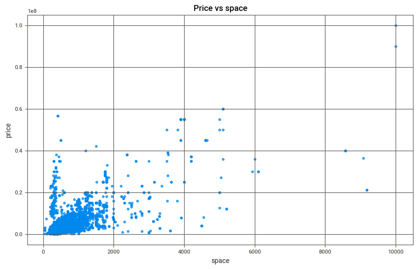
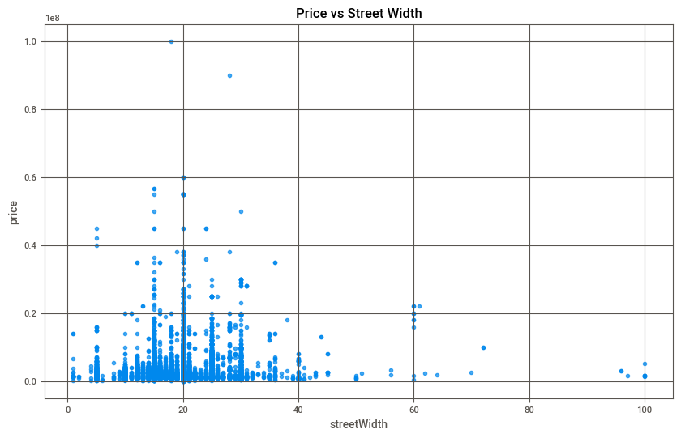
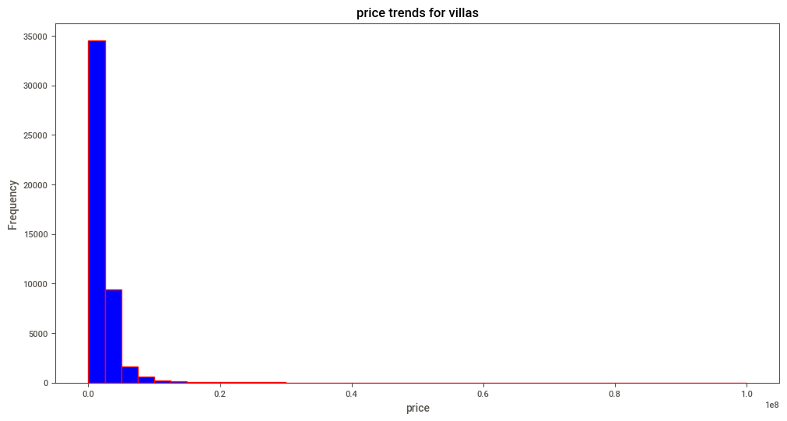

# Real Estate Price Analysis in Riyadh

## 1. Team Members:
- Mamdouh Alsharari
- Lama Albeshri
- ABDULKREM AL SHAMMARI
- Taif Alanazi
- Kawthar Al-marzouq

## 2. The like of our streamlit app

- https://usecase-6-project-3-deep-dive.streamlit.app/

## 3. Introduction (Problem, Objectives):
Real estate prices fluctuate due to various factors such as location, building age, and size. However, certain other factors, like the villa’s front orientation and the width of the street in front, might also play a crucial role. In this project, we aim to analyze the impact of these lesser-known factors using real estate data from Riyadh. Our objective is to reveal hidden insights and provide a data-driven analysis of how these elements influence villa prices.

## 4. Dataset Overview and Source:
The dataset used for this analysis come in three different datasets  contains information on apartments, lands and villas in Riyadh. Key variables include:
- **Location**: The region or district in Riyadh.
- **Space**: The size of the villa (in square meters).
- **Front Orientation**: The direction the front of the villa faces (e.g., north, east).
- **Street Width**: The width of the street in front of the villa.
- **Price**: The price of the villa (in Saudi Riyals).
- and other features describe the properties.

- 

## 5. EDA Steps Applied:
We applied the following Exploratory Data Analysis (EDA) steps:
- **Data profiling**: we did profiling for all datasets.
- **Data quality checks** 
- **Data Cleaning**: We checked for missing values and removed irrelevant columns.
- **Feature Selection**: We selected key features, such as location, front orientation, space, and price, to focus our analysis.
- **Data Filtering**: We filtered the data based on user input (location and space) in the Streamlit app to focus on specific regions and villa sizes.
- **Visualization**: Using Plotly, we created interactive bar charts to show the relationship between villa prices and front orientation, with an animation based on villa space.

## 1. Key Questions Answered:
We aim to answer the following questions using the dataset:

1. **How does the orientation of the villa's front impact its price?**
   - We investigate whether a villa's front direction (e.g., north-facing, east-facing) affects its price in different locations. (answered in our streamlit app)
   
2. **How does the villa's space (area) affect its price?**
   - We analyze how the space of the villa influences the price across various regions of Riyadh. 
	- Regarding whether space impacts villa prices, the chart below indicates that as space increases, so does the price.

	 
   
3. **Does the width of the street in front of the villa impact its price?**
   - We explore whether the street width correlates with price fluctuations when controlling for location and other factors.

	   

4. **What are the price trends for villas in different areas of Riyadh?**
   - To understand the price range for villas in Riyadh, refer to the chart below, showing prices ranges between 1,000,000 and 3,000,000.
	
	

## 6. Conclusion:
The analysis revealed that both the villa's front orientation and the width of the street can significantly influence its price. Villas facing certain directions, such as north or east, tend to have higher prices in certain regions. Similarly, larger street widths may positively affect prices. This analysis can guide future property buyers or real estate professionals in making informed decisions when assessing villa prices in Riyadh.
